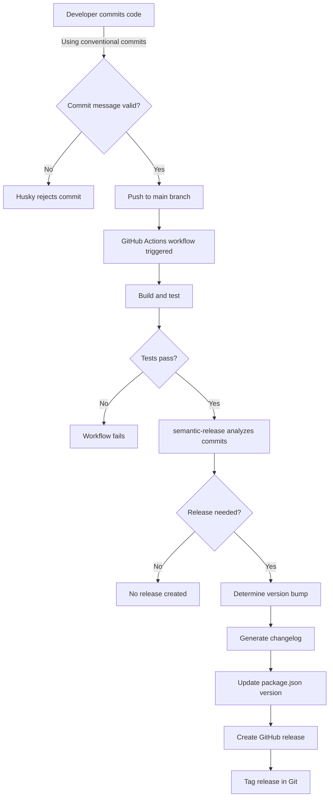

# Semantic Release Implementation Plan

## Overview

We'll implement semantic-release in the Smartsheet MCP Server project with the following features:
- Automatic versioning based on conventional commits
- GitHub releases integration
- Automatic changelog generation
- Commit message validation using commitlint and husky

## Implementation Steps

### 1. Install Required Dependencies

We'll need to install several packages:

```bash
# Core semantic-release packages
npm install --save-dev semantic-release @semantic-release/github @semantic-release/changelog @semantic-release/git

# Commit message linting
npm install --save-dev @commitlint/cli @commitlint/config-conventional

# Git hooks
npm install --save-dev husky lint-staged
```

### 2. Configure Semantic Release

Create a `.releaserc.json` file in the project root with the following configuration:

```json
{
  "branches": ["main"],
  "plugins": [
    "@semantic-release/commit-analyzer",
    "@semantic-release/release-notes-generator",
    ["@semantic-release/changelog", {
      "changelogFile": "CHANGELOG.md"
    }],
    "@semantic-release/npm",
    ["@semantic-release/github", {
      "assets": [
        {"path": "build/**", "label": "Build artifacts"}
      ]
    }],
    ["@semantic-release/git", {
      "assets": ["package.json", "CHANGELOG.md"],
      "message": "chore(release): ${nextRelease.version} [skip ci]\n\n${nextRelease.notes}"
    }]
  ]
}
```

### 3. Set Up Commit Message Linting

Create a `commitlint.config.js` file:

```javascript
module.exports = {
  extends: ['@commitlint/config-conventional']
};
```

### 4. Configure Husky for Git Hooks

Initialize husky and set up the commit-msg hook:

```bash
npx husky install
npx husky add .husky/commit-msg 'npx --no -- commitlint --edit $1'
```

Update package.json to include husky setup:

```json
{
  "scripts": {
    // existing scripts
    "prepare": "husky install"
  }
}
```

### 5. Create GitHub Actions Workflow

Create a `.github/workflows/release.yml` file:

```yaml
name: Release
on:
  push:
    branches:
      - main

jobs:
  release:
    name: Release
    runs-on: ubuntu-latest
    steps:
      - name: Checkout
        uses: actions/checkout@v3
        with:
          fetch-depth: 0
          
      - name: Setup Node.js
        uses: actions/setup-node@v3
        with:
          node-version: 16
          cache: 'npm'
          
      - name: Install dependencies
        run: npm ci
        
      - name: Build
        run: npm run build
        
      - name: Test
        run: npm test
        
      - name: Release
        env:
          GITHUB_TOKEN: ${{ secrets.GITHUB_TOKEN }}
        run: npx semantic-release
```

### 6. Update Documentation

Update the README.md to include information about:
- The semantic versioning strategy
- How to write commit messages following conventional commits
- How releases are generated

## Workflow Diagram



## Commit Types and Version Bumps

| Commit Type | Description | Version Bump |
|-------------|-------------|--------------|
| `fix:`      | Bug fixes | Patch (0.0.1) |
| `feat:`     | New features | Minor (0.1.0) |
| `BREAKING CHANGE:` | Breaking API changes | Major (1.0.0) |
| `docs:`     | Documentation only | No version change |
| `style:`    | Code style changes | No version change |
| `refactor:` | Code refactoring | No version change |
| `perf:`     | Performance improvements | Patch (0.0.1) |
| `test:`     | Adding tests | No version change |
| `chore:`    | Build process or auxiliary tool changes | No version change |

## GitHub Permissions

For this setup to work properly, you'll need to ensure:

1. The `GITHUB_TOKEN` has write permissions for:
   - Contents (to create releases)
   - Issues (to comment on related issues)
   - Pull requests (to comment on related PRs)

2. In your repository settings, under Actions > General > Workflow permissions:
   - Set "Read and write permissions" for the default GITHUB_TOKEN

## Implementation Timeline

1. **Day 1**: Install dependencies and create configuration files
2. **Day 1-2**: Set up GitHub Actions workflow
3. **Day 2**: Test the setup with sample commits
4. **Day 2-3**: Update documentation and train team members

## Potential Challenges and Solutions

1. **Challenge**: Ensuring all team members follow the conventional commits format
   **Solution**: Provide documentation and examples; enforce with commitlint

2. **Challenge**: Managing breaking changes across versions
   **Solution**: Clearly document breaking changes in commit messages and CHANGELOG

3. **Challenge**: Handling release failures in CI
   **Solution**: Set up notifications for failed workflows; document troubleshooting steps

4. **Challenge**: Managing dependencies between components
   **Solution**: Consider using monorepo tools if project grows to multiple packages